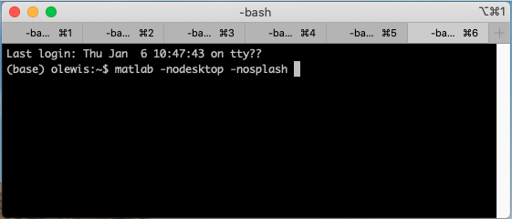

<h1> Simple Matlab Tutorial</h1>

This repository began as a tutorial and simple simulation distribution idea for my Math 412 class.
I have modified it slightly to make it less specific to that course. Now it will serve as a very bare bones help document to assist students who have never used Matlab for university coursework before. 


<h2>Matlab</h2>

Matlab is a general purpose mathematics and computing environment sold by MathWorks.
As a UNM Student, you have access to a free download of Matlab with your UNM ID. 
To install it on your personal computing device, follow the instructions found on the UNM IT website [here](http://it.unm.edu/download/). 


<h3>Starting Matlab</h3>
Starting the Matlab environment differs depending on your operating system and/or computing environment. 
On many systems, running Matlab is as simple as clicking the icon on your desktop. 
Below you can see a screenshot of the Matlab icon on the Dock of my Mac (it's the icon that looks like an orange mountain with a flat blue valley behind it). 
Starting Matlab on a Windows machine is a very similar process.


If you are using a Linux operating system (or even on Mac), you may want/need to start Matlab via the shell. 
To do so, you simply type the command 

```bash
	matlab
```
and Matlab should fire right up with its normal graphical interface. 
The ``matlab`` command accepts a wide variety of options and flags to customize your experience. 
In the interest of reducing the system resources demanded by Matlab, I often like to forgoe the standard graphical interface, and also skip the "splash screen" at startup. 
To do this, you can add the ``-nodesktop`` and ``-nosplash`` options (see below). 

```bash
	matlab -nodesktop -nosplash
```


<h3>Using Matlab</h3>
Once you have started Matlab on your computer, you will be greated with something similar to the following screenshot (assuming you did not supress the graphical interface at startup). 
Not everyone's Matlab environment will be laid out the same way. Users have the ability to move/alter some of the relevant pieces, so yours may look slightly different. 
However, you should have access to the same relevant functionalities. 


The relevant areas are:

* The "Toolbar" (at the top). This toolbar contains many various functions such as creating new Matlab files/scripts (more on these later), changing the path (more on this later), altering your preferences, and many more. 
* The "Current Folder" window (at the left). This shows the contents of the current (or present) working directory. The full path leading to the current directory is also shown in the long horizontal bar just below the toolbar. 
* The "Command Window" (in the center). This is the main interface for Matlab. Here you will type the commands you wish to execute (followed by "enter"). This is also where Matlab will print any textual information that results from the commands you run. 
* The "Workspace" (on the right). This shows all of the variables that Matlab currently has stored in memory (that are within scope), as well as a tiny amount of information pertaining to those variables (i.e. what "type" they are, etc). 

If you chose to start Matlab from your shell (Linux & Mac users) without the graphical interface then you will be greeted instead with something like this:


What you see is effectively _just_ the "Command Window" from before, but sitting inside my computer's terminal. 
Anything that can be done in the "Command Window" from the previous image can be accomplished by typing the same commands into this prompt. 

<h2>Directories, Working Directories, and Path</h2>

Matlab uses a "path" system in order to know where to look for functions and data in order to carry out whatever tasks you attempt. 
Roughly speaking, the "path" is giant list of directories on your computer where Matlab will look for functions that you call. 
If information is not in the path, Matlab effectively does not know about it. 
By default, the path contains a large collection of directories within the location that Matlab was installed on your system. 
If you wish to see the default path, you can use the following Matlab command by typing it into the Command Window and pressing enter:
```matlab
path
```

You will be greeted with a staggering list of places that Matlab has stored all of its built in functions:


The path _can_ be edited.
This is even something you might want to do once you've built up a large collection of Matlab files that you use regularly. 
However, I recommend that you do not remove any of these directories from the path, and that you do not modify any of the files in the default path. 
These are the nuts & bolts of Matlab, and tinkering with them can have unintended consequences.
Instead I recommend that you make a new directory on your computer (probably under "Documents", and certainly not underneath the standard Matlab installation) where you can store all of your various projects in their own sub-directories.  

<h3>Present Working Directory</h3>
At any given time, Matlab is "running" in some directory on your computer. 
This is known as the "Present Working Directory". 
When you run any command, Matlab will look for the necessary files/data in the present working directory, in addition to the path. 
This means that if you place all of your Matlab files in a well organized folder, as long as that folder is the present working directory, Matlab will have access to all of your work (and the built in functions) without needing to modify the path in any way. 
If you want to know what the present working directory is, you can use the ``pwd`` command. 
Matlab will return some text along the lines of:

```matlab
ans =

    '/Users/OwenLewis/directory/where/I/currently/am'
```

In order to change the present working directory, you can use the ``cd`` command (for "change directory"). 
For example, I could type the following command and hit enter:

```matlab
cd /Users/OwenLewis/directory/where/I/want/to/work
```

This will change my present working directory. 
Now, if I were to use the ``pwd`` command again, I would receive the following text:

```matlab
ans =

    '/Users/OwenLewis/directory/where/I/want/to/work'
```

If you are not a fan of using the Command Window, all of this can be accomplished by using the graphical interface as well. 
In the screenshot below, the bar circled in red shows the present working directory. 
Circled in green are the various files that are within the present working directory. 
I can navigate up and down the file tree (effectively changing the present workign directory) by clicking the icons just above the green circle and/or folders in the "Current Folder" window. 
You will also notice there is a file called "my_matlab_file.m" sitting in the "Current Folder". 
More on that next. 


<h2>Matlab Files</h2>

To use Matlab effectively and efficiently you will want to create various Matlab files. 
Matlab files are effectively just text files into which you write (mostly) Matlab commands exactly as you would have typed them into the command window. 
You then name the file with the extension ".m". 
Any text that comes after a percent sign (``%``) is considered a "comment" and will be ignored by Matlab (until the next line begins). 
Comments are an important part of creating Matlab files, as they allow you to add text explaining to yourself (and anyone else) what your Matlab files is supposed to be doing. 
Use them!

Matlab files come in two important categories: scripts and functions. 
They are largely similar, but behave in a few importantly distinct ways. 

<h3>Scripts</h3>
At their most basic, script files are just a giant list of Matlab commands that you wish to run in a sequential order. 
When they are "run", Matlab will effectively input every bit of text within the script into the Command Window, in order. 
Scripts are extremely useful if you must perform the same, large list of commands more than one time. 
Instead of typing out 300 commands, waiting for the result, and the starting over, you can type them into a script file once, and then "run" that file as many times as you wish. 
For example, a basic matlab script file might contain the following:

```matlab
%This is a comment and will be ignored
%Lets create a 2x2 matrix
A = [2,6;4,8];
%and a vector
v = [1;2];
%Now lets solve the equation A*x = v:
x = A\v
```
If I were to place this text into a file called "whateverIwant.m", I could run this list of command at any time (as long as that file is in the path, or the present working directory) via the command

```matlab
whateverIwant
```

Notice that the file name has to end in ".m", but running the script does not include this file extension. 
Running this command will greet me with the following text in the Command Window:
```matlab
x =

    0.5000
         0
```

This vector is indeed the solution to the equation ``A*x = v``. 

If you look at the Workspace window (see next screenshot), you will also notice that the variables ``A``, ``v``, and ``x`` should have appeared. 
This is because any variables/data that a script creates will act exactly as if you had created them manually via the Command Window. 


<h3>Functions</h3>
Matlab files that contain functions operate a little bit differently. 
The easiest way to think of them is as mathematical functions. 
They take input, and give back output. 
A file that contains a function must begin and end with particular syntax:

```matlab 
   %Here I put any comments about the overall behavior of the function
   <outputs> = function <name_of_function>(<inputs>)
   	.
   	.
   	.
   	<a bunch of commands>
   	.
   	.
   	.
   end
```

A few important things to note:

* You can have a large number of outputs. Simply place them inside square brackets and separate them with commas. For example: ``[A,B,eps]``.
* You can have multiple inputs as well. Place them all inside the parenthesis and separate them with commas. For example: ``(foo,bar)``.
* The name of your function and the name of the file it is stored in **must** match. For example, the function ``solve_matrix`` must be contained in a file named "solve_matrix.m". 

For example, here is a potential Matlab function contained in the file "solve_matrix.m"

```matlab 
   %A very simple function to solve 2x2 matrix equations
   x = function solve_matrix(A,v)
   		%Lets solve the equation!
   		x = A\v;
   end
```

Now, to use the function that I have written, I call it via the command line. 
However, because it is a _function_ I have to privide it with the necessary input:

```matlab 
	foo = solve_matrix([2,6;4,8],[1;2])
```

Running this command in the Command Window will result in the following text:

```matlab
foo =

    0.5000
         0
```

A few things of note here:

* If you look at the workspace at this point (next screenshot), you will notice that there is a variable named ``foo``, but no variables named ``A``, ``v``, or ``x``. 
This is because variables within functions are not publicly available to the workspace. 
They are private (if you want to know more, look up the subject of "scoping" with regards to computer science). 
Effectively, those variable names are completely internal to the function named "solve_matrix". 
This is actually one of the major advantages to functions as opposed to scripts. 
* The numerical result is the same as our example script, but the name is different. 
This is because our last command assigned the name ``foo`` to the output of the function "solve_matrix". 
The internal workings of the function (and thus the variable named ``x``) are completely obscured. 
Think of functions as a black box. Input goes in, output comes out, and we have no knowedge of their internal workings when we call them from the Command Window. 


Finally, I want to draw attention to the line of comments at the top of my theoretical function file. 
Any comments that come above line defining the inputs, function name, and outputs are treated as the "help" section of the function. 
These can be viewed at any time by using the ``help`` command. 
For example, I could invoke the following command:

```matlab 
help solve_matrix
```
and Matlab would greet me with the following text:
``` 
A very simple function to solve 2x2 matrix equations
```

It can be useful to put some time into these help sections of your functions: explaining what they do, what inputs are expected, and what the outputs represent. 


<h2>Slightly less basic basics</h2>
Now that we have gone over the bare basics of getting Matlab working, it is probably worthwhile to go through some exercises in creating and manipulating variables in Matlab. 
Fortunately, my colleague Jacob Schroder has already put together a nice document to this effect. 
Below, you will find a PDF version of a brief walkthough that he created. 
I have also included a Matlab script file containing, in order, all of the various commands that get invoked in the walkthrough. 
A few of these commands actually call simple Matlab functions, so I have included those as well. 

* The pdf file can be found right [here](./matlab_tutorial.pdf).
* A Matlab script that mirrors the walkthrough can be found [here](./matlab_tutorial.m).
* The tutorial involves steps that call the functions [my_funky_fcn.m](./my_funky_fcn.m), [ApproxExp.m](./ApproxExp.m), [MyDeriv.m](./MyDeriv.m), [f1.m](./f1.m), and [df1.m](./df1.m). 

**Remember:** In order for any of these provided ".m" files to be used, you will need to download them and place them into either your path, or your present working directory. 
